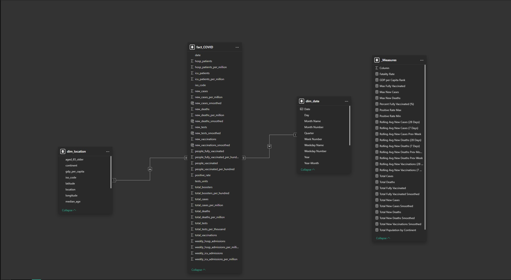
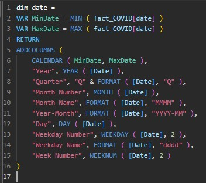
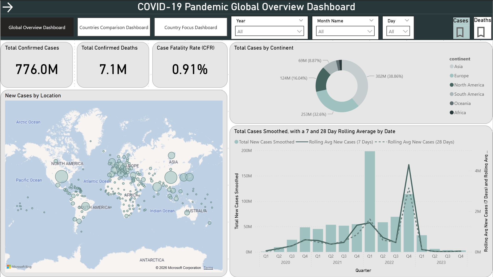
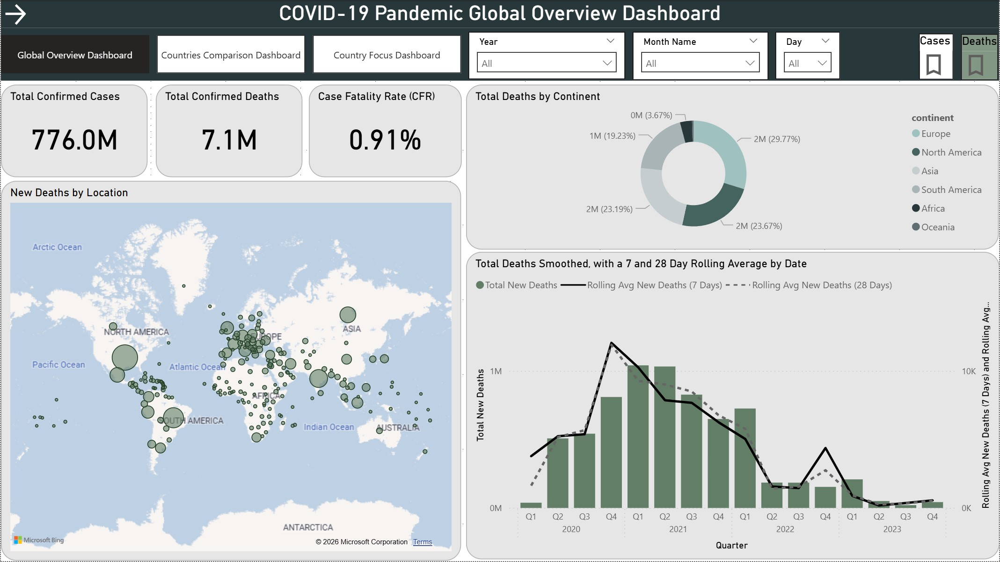
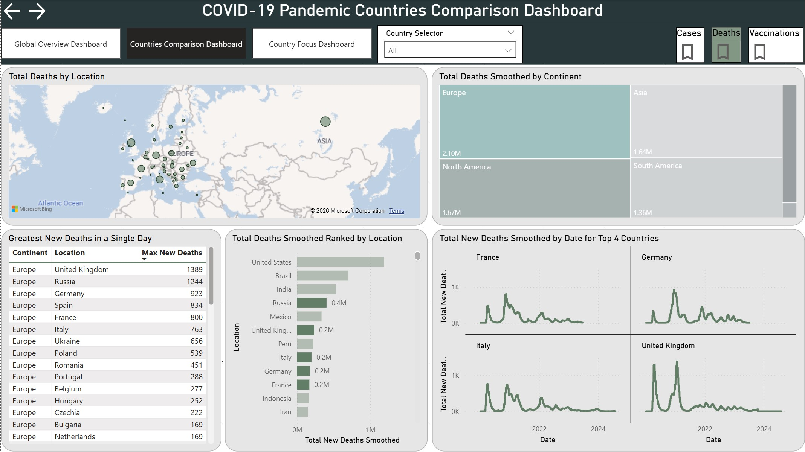
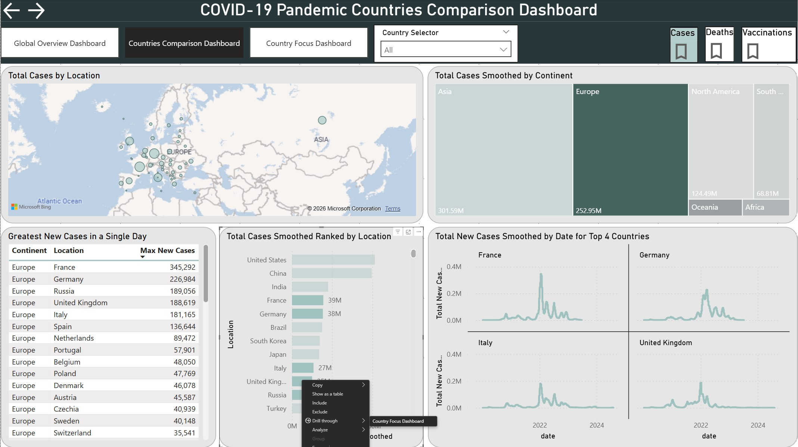
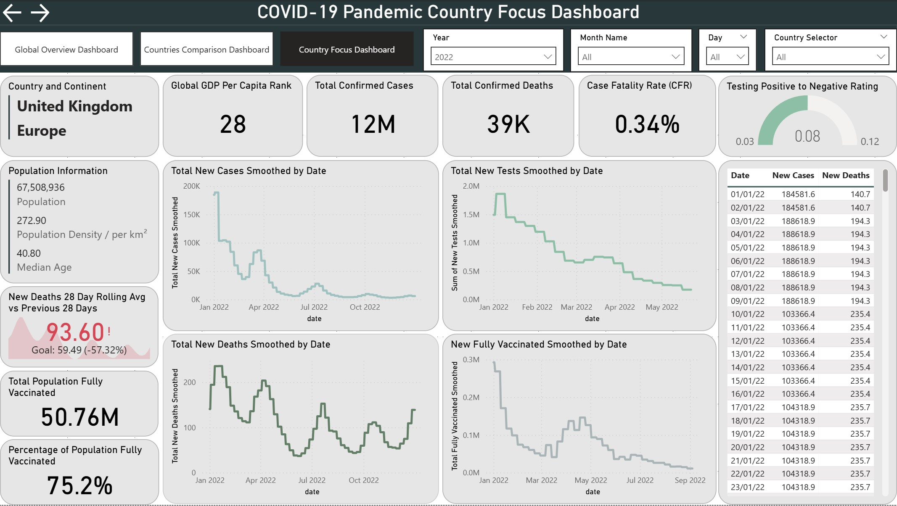

# Portfolio-Project-PowerBI-COVID-19
# 🦠 Advanced COVID-19 Global Impact & Trend Analysis

## 📌 Project Overview
This project presents an **advanced Power BI analytics solution** designed to explore the global progression and impact of COVID-19 through **time-series analysis, geographic comparisons, and drill-through reporting**.

The dashboard enables users to move from a **high-level global overview** to **country-specific and daily-level insights**, supporting deeper analytical exploration of pandemic trends, severity, and outcomes.

---

## 🛠 Key Power BI Techniques Demonstrated

This project showcases a range of Power BI skills relevant to BI roles:

✔ Data cleaning and shaping using **Power Query Editor**  
✔ **Star schema** design in data modelling  
✔ Advanced **DAX measures** including time-intelligence calculations
✔ Interactive slicers and dynamic visuals  
✔ **Drill through** pages
✔ **Bookmarks**
✔ Interactive, user-driven exploration
✔ Navigation buttons
✔ Custom theme

---

## 🎯 Project Objectives
The primary goals of this project are to:
- Analyse the temporal evolution of COVID-19 cases and deaths
- Identify and compare pandemic waves and peak periods
- Evaluate severity and outcomes using derived metrics
- Enable interactive exploration via drill-through and slicers
- Demonstrate advanced Power BI skills suitable for a professional portfolio

---

## 📂 Dataset
The dataset is sourced from **public COVID-19 datasets on Kaggle**, which aggregate reported data from international health authorities and government sources.
🔗 [Dataset](https://www.kaggle.com/datasets/joebeachcapital/coronavirus-covid-19-cases-daily-updates/data)

### Dataset Characteristics
- Large-scale time-series data
- Multi-geographic coverage (global and country level)
- Inconsistent reporting and missing values
- Requires data cleaning, transformation, and modelling
-‘Daily’ data initially at weekly granularity requires smoothing

---

## 🛠 Data Preparation & Modelling
- Data cleaning and transformation performed using **Power Query**
- Missing values handled and reporting inconsistencies standardised
- A **star schema** model implemented:
- Fact table for daily COVID-19 metrics
- Dimension tables for Date and Location
- Dedicated Date table created with DAX and marked as a date table
- Correct relationship cardinality and filter direction enforced

---

## 📐 Key Measures & Calculations
The dashboard includes advanced DAX measures such as:
- Total confirmed cases and deaths
- Daily new cases and deaths
- Rolling averages (7-day / 28-day)
- Case Fatality Rate (CFR)
- Global GDP rankings
- Peak detection (maximum daily cases per country)
- Country ranking by selected metrics

---

# 📊 Report Pages

##📄 Page 1 — Global Overview Dashboard
**Purpose:** Provide a high-level snapshot of the global pandemic situation.
| Page 1 – Cases | Page 1 – Deaths |
|---------------|-------------|
| 
|  |

## 📄 Page 2 — Country Comparison Dashboard
**Purpose:** Compare trends, severity, and wave patterns across countries.
| Page 2 – Deaths | Page 2 – Cases + drillthrough |
|---------------|-------------|
| 
|  |

## 📄 Page 3 — Country Focus Dashboard
**Purpose:** Provide a detailed daily breakdown for a selected country.
 

---

## 📈 Expected Outcome
The final deliverable is a **professional, multi-page Power BI dashboard** that allows users to explore COVID-19 data at multiple levels of detail. The project demonstrates:
- Advanced data modelling and transformation
- Strong command of DAX and time intelligence
- Effective dashboard and UX design
- Analytical depth beyond basic reporting

---

## ✨ Credits & Acknowledgements
- Power BI Desktop
- Power Query (M)
- DAX
- Kaggle (data source)

---

## 📂 Files in This Repository

| File / Folder | Description |
|---------------|-------------|
| `project COVID-19` | Power BI Desktop report file |
| `screenshots/` | Dashboard screenshot assets |
| `README.md` | This documentation |

---

## Connect With Me

